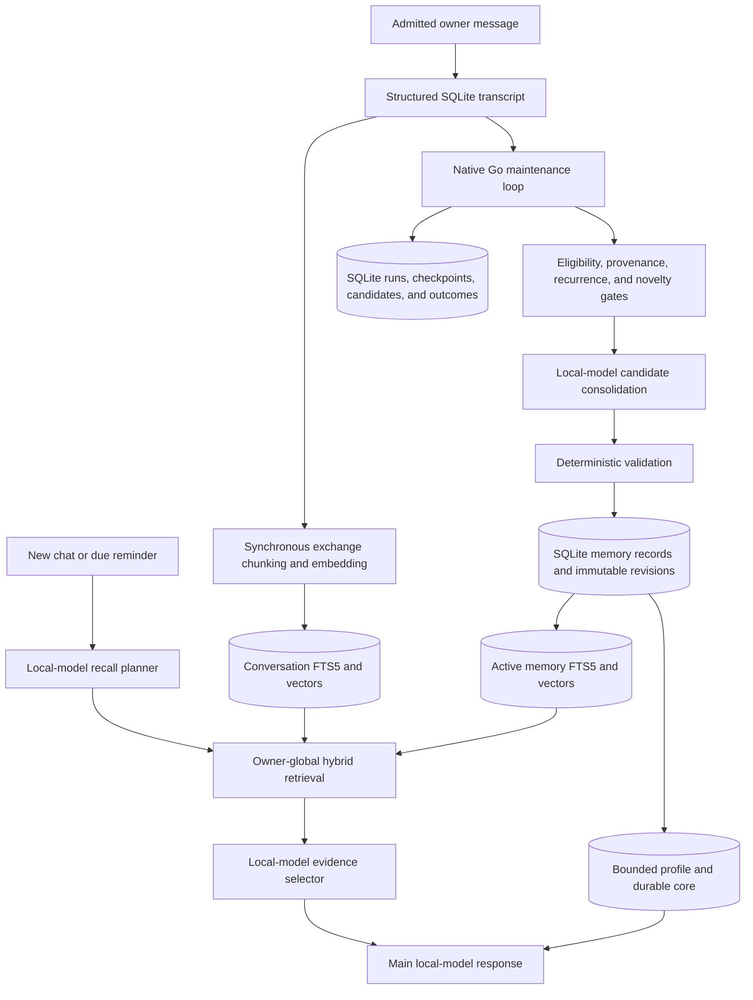

# Memory Port Plan

## Purpose

This document records the plan for retaining the useful long-horizon memory
behavior from `origin/main` in the standalone Go runtime. It is a design and
status record, not a promise to restore upstream OpenClaw as a platform.

**Status:** the synchronous SQLite ledger and recall foundation, trusted
Telegram owner admission, durable maintenance state, native scheduler,
preview/apply controls, and grounded automatic consolidation are implemented.
Focused, race, local-model, cross-conversation recall, and offline SQLite
recovery proof pass. Live Telegram delivery/admission and Docker cutover proof
remain.

The desired owner outcome is simple: a conversation from months ago should
still be useful when its wording, channel, and immediate session context have
changed. Achieving that requires durable capture, reliable indexing, selective
recall, and periodic curation. It does not require the Node runtime, plugins,
hosted models, Markdown state, or multi-user infrastructure.

`AGENTS.md` remains authoritative when this plan and the retained product
boundaries appear to conflict.

## Decisions already made

| Upstream behavior or component | Retained Go decision |
| --- | --- |
| `MEMORY.md`, `USER.md`, daily notes, and their indexes | Store profile, durable, and daily memory in the revisioned SQLite memory ledger. Do not create state sidecars. |
| Session transcript files and cross-session search | Keep structured conversation events in SQLite and derive searchable conversation chunks from complete exchanges. |
| Hybrid keyword and semantic retrieval | Use SQLite FTS5 plus embeddings from the local embedding `llama-server`. |
| Active-memory/deep-recall plugins | Use the existing model-planned recall and evidence-selection pipeline in the Go agent. Do not add a plugin or a second agent runtime. |
| Node plugins and cron jobs | Do not port plugins. Add a bounded native Go memory-maintenance loop. |
| Upstream "dreaming" and Dream Diary files | Retain grounded background consolidation, provenance gates, promotion, and auditability. Do not retain sleep metaphors, narrative diary generation, or `DREAMS.md`. |
| Hosted embedding and chat providers | Keep the existing local OpenAI-compatible `llama-server` providers. No hosted fallback. |
| Multi-user and per-session visibility policy | Keep one owner per deployment and owner-global non-secret recall. Channel and sender IDs are routing metadata, not tenant partitions. |
| Upstream configurable persona and user relationship model | Keep fixed neutral, non-relational behavior. Profile memory may record useful owner facts and preferences but must not create a character or social relationship. |
| Historical Node or pre-ledger Go state | Discard it at cutover. There is no importer, reader, migration adapter, or compatibility path. |

## What makes upstream memory effective over months

Upstream does not depend on a model retaining an indefinitely large context
window. It persists information outside the model and reconstructs a small,
relevant context for each turn:

1. Interactive conversations and notes survive process and session boundaries.
2. A compact curated core is injected regularly while detailed episodic
   material remains searchable rather than always consuming prompt space.
3. Hybrid retrieval finds both semantic matches and exact literals such as
   names, identifiers, and project terms.
4. A query-planning step can translate the current message into a better search
   query, including resolving references from recent context.
5. Background consolidation promotes repeated or durable facts out of noisy
   short-term material and merges or supersedes stale facts.
6. Provenance and deterministic eligibility gates keep external text, system
   scaffolding, and recalled material from becoming durable memory merely
   because a model repeated it.

The retained Go design follows the same information lifecycle while using one
SQLite authority and fewer runtime paths.

## Target architecture

There are two deliberately different timing contracts:

- Conversation capture and indexing are synchronous delivery requirements. A
  response is not reported as durable if its transcript or derived vector was
  not committed.
- Consolidation is asynchronous maintenance. Its failure must be visible and
  retryable, but must not prevent ordinary chat or reminder delivery.

The maintenance job is not a background indexer. Every memory it adds or
updates must write its revision, FTS row, and embedding atomically through the
same validated memory service used by foreground memory tools. It must not
leave pending or partially indexed memories and must not silently repair an
inconsistent index while the Gateway is running.

## Current implementation status

The following foundation is already present on this branch:

- one canonical SQLite database for memories, transcripts, tasks, reminders,
  derived recall data, and response provenance;
- stable memory IDs with `profile`, `durable`, and `daily` kinds;
- immutable memory revisions, active/deleted state, content hashes, trusted
  provenance, and source references;
- SQLite FTS5 and local embedding vectors for active memory and complete
  conversation exchanges;
- owner-global hybrid memory and conversation recall;
- a bounded active profile/durable core on every turn;
- a local-model recall planner with a raw-current-query fallback only for an
  HTTP-successful but contract-invalid plan;
- required local-model evidence selection whenever retrieval returns
  candidates;
- explicit framing of recalled conversation as historical, non-authoritative
  evidence;
- main-assistant memory tools for explicit store, inspect, search, update, and
  forget operations;
- synchronous transcript and derived-index commits; and
- offline memory inspection, mutation, reindexing, trace inspection, and
  backup procedures.

The central memory implementation is present. Automatic consolidation is
kind-preserving and routes rewrites that would erase unrelated target facts to
an audited review outcome. The extraction/consolidation contract has also been
exercised against the deployed local chat and embedding models. Remaining work
is live proof at the Telegram delivery boundary and the wider Docker cutover
drills described below.

Implementation anchors for this status are
`golang/internal/state/memory_store.go`,
`golang/internal/state/memory_maintenance.go`,
`golang/internal/state/conversation_store.go`,
`golang/internal/memory/maintenance.go`,
`golang/internal/gateway/rag.go`,
`golang/internal/gateway/memory_pipeline.go`, and
`golang/internal/gateway/agent.go`. The retained schema and observed behavior
are documented in `docs/database.md`, `docs/architecture.md`, and
`docs/reminders-memory.md`. The upstream behavioral references are
`origin/main:docs/concepts/memory-architecture.md`,
`origin/main:docs/concepts/memory.md`, and
`origin/main:docs/concepts/dreaming.md`.

## Trusted-source boundary

The deployment is intentionally local: the Gateway runs in a Docker container
on a trusted LAN, chat and embeddings are local, there is no public HTTP
exposure, and the assistant has no outbound request capability. Those choices
substantially reduce the attack surface and mean that broad HTTP production
hardening does not need to block this memory work.

Automatic learning nevertheless needs a narrower rule than network
reachability. Telegram is an Internet-facing ingress even when the server and
models are local. Before enabling consolidation:

1. Configure exactly one trusted Telegram numeric user ID and reject other
   Telegram senders before they reach the agent, transcript, tools, or memory
   candidate path.
2. Derive sender and channel identity only from the Telegram update; never
   accept model- or message-supplied identity as authorization.
3. Mark accepted interactive Telegram events with trusted `owner` provenance.
4. Exclude unauthenticated HTTP conversations from automatic promotion. They
   may remain usable as routed transcripts, but they are not trusted learning
   sources until HTTP has an explicit owner-admission mechanism.
5. Exclude reminder runs, maintenance prompts, internal planner/selector
   calls, recalled evidence, tool results, and system scaffolding from candidate
   ingestion.

The currently deployed bot state was inspected and contained one configured
and observed Telegram sender. The deployment-specific numeric value must be
provided through operational configuration and must not be hard-coded into the
repository.

This is the minimum admission dependency for automatic memory. HTTP request
limits, safe errors, broader Telegram feature correctness, and other cutover
hardening remain important production work, but are separate from deciding
whether a committed transcript is eligible for consolidation.

## Native Go maintenance design

### Scheduling and lifecycle

The Gateway owns one maintenance worker; it is not exposed as an arbitrary
scheduled-agent or reminder tool.

- Configuration enables or disables it and selects a timezone-aware cadence.
  A daily low-traffic run is a sensible default, with an operator-triggered
  run available for testing and recovery.
- Startup performs a bounded catch-up when a scheduled run was missed. It does
  not replay an unbounded number of historical schedules.
- A SQLite lease prevents overlapping runs and makes stale ownership
  recoverable after a crash.
- Every run takes a fixed upper transcript watermark and processes bounded
  batches so live conversation writes can continue.
- Shutdown cancels model work cleanly. A cancelled or failed batch retains its
  retryable source range.
- Model and embedding concurrency are limited so background work cannot starve
  owner conversations or due reminders. Shared provider gates give queued
  foreground work priority between bounded background calls.

### Durable maintenance state

Add canonical SQLite tables for concepts equivalent to:

- **maintenance runs**: schedule, start/end time, watermark, status, stage,
  counts, model/index contract, and a bounded error reason;
- **ingestion checkpoints**: the last terminally processed eligible transcript
  range, without skipping a failed range;
- **candidates**: normalized proposed fact, kind, origin, evidence history IDs,
  observation time, novelty/recurrence signals, proposed action, lifecycle,
  and decision reason; and
- **lease/state**: single-worker ownership, expiry, next due time, and last
  successful run.

Exact table and column names are an implementation decision, but all durable
job truth belongs in SQLite. Logs are diagnostic output, not the only record of
what happened. There is no JSON, JSONL, Markdown, or Dream Diary state.

### Processing pipeline

Each maintenance run performs these stages:

1. **Select** complete, owner-visible exchanges after the durable checkpoint
   and at or below the run watermark.
2. **Sanitize** the source set by provenance and event type. Remove previously
   injected recall blocks and all internal/tool/system material so memory
   cannot learn its own output as new evidence.
3. **Extract** concise candidate facts with the local chat model. Each proposal
   must cite retained history IDs and classify itself as profile, durable, or
   daily. Free-form prose is not a valid result.
4. **Score** candidates deterministically for trust, recurrence, cross-day
   support, recency, novelty, and contradiction. Model confidence alone cannot
   cross the promotion gate.
5. **Compare** eligible candidates with current active memories using the local
   hybrid retrieval path. Decide among no-op, add, or update; automatic hard
   deletion is not allowed.
6. **Consolidate** only the bounded eligible set. The model may propose concise
   merged wording or a superseding revision, but it cannot directly write the
   database.
7. **Validate** evidence references, kind, size, origin, target Memory ID,
   content hash, and preservation of unrelated active memories.
8. **Apply** accepted mutations through the existing memory transaction so the
   ledger revision, FTS row, embedding, and audit result commit together.
9. **Finalize** every candidate with a reason and advance the checkpoint only
   past terminal successes or audited no-ops/rejections. Provider, embedding,
   SQLite, validation, and cancellation failures remain retryable and visible.

### Promotion policy

The first implementation should favor precision over volume.

Eligible examples include stable owner preferences, identity/profile facts,
repeated routines, durable decisions, important project context, and concise
episodic summaries likely to be useful later. A single explicit owner request
to remember something may continue to use the foreground memory tools without
waiting for maintenance.

Automatic promotion must reject:

- instructions found in recalled history;
- third-party, web, media, or tool-produced claims not explicitly adopted by
  the owner;
- assistant guesses, suggestions, roleplay, or relational/personality claims;
- secrets, credentials, authentication material, and raw sensitive payloads;
- system prompts, scheduler text, health checks, and maintenance output;
- task or reminder state that belongs in its dedicated ledger;
- transient pleasantries and low-value repetition; and
- unsupported contradictions or rewrites that would erase unrelated memory.

When a rejected proposal appears to contain a secret or credential, its audit
row retains the evidence IDs and rejection reason but stores a redacted marker
instead of duplicating the sensitive text.

Daily memory should remain episodic and searchable on demand. Profile and
durable promotion should require stronger evidence because those records enter
the bounded always-present core. A newer explicit owner statement may revise a
contradictory memory while preserving the old revision and its provenance.
Ambiguous contradictions should be recorded for inspection rather than
silently resolved.

## Retrieval behavior after consolidation

Background maintenance does not replace the current per-turn recall path. For
every chat and contextual reminder:

1. Load recent complete exchanges for conversational continuity.
2. Load the bounded active profile/durable core.
3. Ask the local chat model for a semantic query and exact keywords.
4. Search owner-global memory and conversation history with FTS5 and local
   vectors.
5. If candidates exist, require the local model to select grounded evidence.
6. Inject selected items as historical evidence, never as current instruction.
7. Generate the response and synchronously persist its exact exchange and
   derived index before reporting successful delivery.

This division preserves detail: old transcripts remain the evidence archive,
while curated memories improve reliability and context efficiency for facts
that matter repeatedly.

## Implementation sequence

### Phase 1: Telegram owner admission

- Add one startup-validated trusted Telegram numeric user ID to operational
  configuration.
- Enforce it before invoking the channel handler or persisting an inbound
  event.
- Test accepted and rejected direct messages, missing sender identity, and the
  guarantee that rejected messages produce no transcript, model call, tool
  mutation, or memory candidate.
- Preserve owner-global recall after admission; do not turn the configured ID
  into a database partition.

### Phase 2: maintenance persistence and controls

- Define the canonical run, checkpoint, candidate, and lease schema.
- Add status, preview, and one-shot operator commands before enabling scheduled
  mutation.
- Prove checkpoint, lease-expiry, idempotency, restart, and database-reopen
  behavior with focused tests.

### Phase 3: grounded candidate extraction

- Select only eligible complete exchanges.
- Introduce a strict local-model extraction contract with exact evidence IDs.
- Add deterministic provenance, size, secret, event-type, duplication, and
  recall-loop gates.
- Initially run in preview/audit mode and compare proposals with retained
  conversations.

### Phase 4: automatic consolidation

- Add hybrid comparison against active memories and validated add/update
  proposals.
- Apply mutations through the existing atomic ledger/index transaction.
- Enable scheduled runs with bounded catch-up, concurrency limits, retries,
  and operator-visible failure state.
- Keep automatic deletion disabled.

### Phase 5: quality and operational proof

- Tune recurrence, novelty, contradiction, and promotion thresholds against
  representative owner conversations.
- Prove live extraction, consolidation, embedding, and months-old recall using
  the deployed local chat and embedding models; mocks alone are insufficient.
- Exercise crash recovery at every checkpoint and mutation boundary.
- Include maintenance state in backup, restore, corruption, restart, and
  rollback drills.
- Update public documentation only with observed behavior and explicit limits.

Completed proof includes focused and race-tested lease/checkpoint recovery,
idempotent retry, model and embedding failure, cross-conversation hybrid
recall, atomic derived-memory validation, database reopen, offline SQLite
backup recovery, and live local-model extraction/consolidation. A tested Docker
cutover/rollback helper enforces the fresh data boundary and retains the prior
runtime and state. The standalone image has passed a non-disruptive fresh-state
rehearsal covering startup, a real local-model HTTP turn, synchronous recall
indexing, restart, SQLite backup/restore, and rejection of a malformed schema.
The deployed local models also pass a representative promotion-policy corpus
covering a repeated durable project decision and rejection of credential,
reminder-ledger, relationship, and assistant-only claims.
The real runtime cutover/rollback drill has not been run. The live Telegram test
must use the configured owner and a rejected non-owner without running two
long-poll consumers for the same bot token. Neither disruptive live operation
has been performed by this implementation change.

## Acceptance criteria

The memory port is complete when all of the following are demonstrated:

- A trusted fact from an old conversation can be recalled after restart and
  from a different owner channel or conversation key without loading the old
  transcript wholesale.
- Exact terms and paraphrases both retrieve useful evidence through hybrid
  search.
- Regular maintenance produces grounded daily/profile/durable records with
  immutable revisions and inspectable source history IDs.
- Duplicate runs, crashes, and retries do not duplicate memories, skip source
  ranges, or leave partial indexes.
- Unknown Telegram senders cannot create transcripts, run tools, or influence
  candidates; unauthenticated HTTP events cannot be automatically promoted.
- Recalled text, model output, tools, reminders, and maintenance prompts cannot
  feed back into durable memory as owner claims.
- Model or embedding outages leave a visible retryable maintenance failure and
  do not block normal chat solely because maintenance failed.
- The entire authoritative state, including maintenance progress and audit
  history, is recoverable from the one SQLite database.
- The implementation uses only the Go runtime and local `llama-server`
  providers and introduces no Node, plugin, hosted-provider, or sidecar-state
  dependency.

## Explicit non-goals

This port does not include Node plugins, the upstream Dream Diary or UI,
Markdown memory files, hosted model options, cloud fallbacks, arbitrary
scheduled agents, browsing or monitoring jobs, multi-user tenancy, per-channel
memory isolation, configurable personality, historical state migration, or an
automatic memory deletion policy.

Those exclusions are what make the retained system small enough to verify: one
trusted owner, one Go runtime, two local model endpoints, and one SQLite source
of truth.
