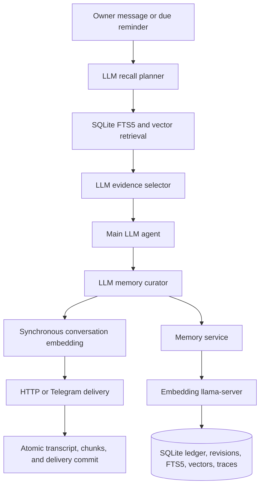

The production image contains one Go binary:

`cmd/openclaw` loads strict configuration, opens SQLite, creates both local
model clients, probes both required local services, validates every derived
index, registers Telegram when enabled, and starts the Gateway.

The agent stores every inbound message, assistant message, tool call, and tool
result as structured transcript rows. Task, reminder, and memory mutations and
their corresponding tool-result rows commit in the same SQLite transaction.

Tasks are one owner-global ledger with no routing or scheduling columns. Their
start and completion timestamps record actual lifecycle events. Reminders are
a separate routed delivery ledger; neither state type references or updates the
other.

Recent context is the latest two complete exchanges for the current routing
key. A bounded profile/durable core is always present. The local chat model
plans recall and selects from hybrid memory and conversation candidates.
Recalled conversations are historical evidence, not current instructions. A
separate local-model curator stores or revises concise profile, durable, and
daily memories after the response draft.

When a reminder is due, the agent loads the same persona, recent exchanges,
and semantic conversation recall used for an inbound turn. It asks the local
chat model for a concise notification body without exposing public tools, adds
the fixed reminder heading, synchronously embeds the completed exchange, and
sends the result. A required-service failure prevents delivery and leaves the
reminder due. Successful deliveries commit transcript and vectors together.

Deleted Node source in Git history may be consulted only as behavioral
evidence. Historical Node application state is deliberately discarded at Go
cutover: the retained runtime does not import, translate, or read it, and no
backward-compatibility path is supported.

The memory-ledger cutover also requires a fresh Go database. Existing Go
tasks, reminders, memories, transcripts, and traces are not migrated.
