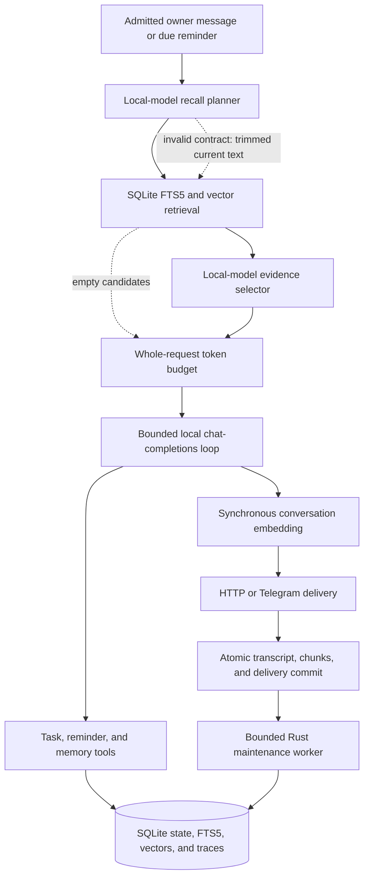

The production image contains one Rust binary:

Startup loads strict public and secret configuration, opens the canonical
SQLite schema, creates local chat and embedding clients, probes both model
servers, validates derived indexes, registers Telegram when enabled, and starts
the loopback Gateway.

## Prompt and tool boundary

The main request uses standard OpenAI Chat Completions roles. A fixed neutral
system prompt comes first, followed by optional historical evidence, complete
prior exchanges, one application-produced current-turn carrier, and a separate
final owner message. The carrier holds minimal routing facts and optional
reply/quote data; quoted text is labelled as data and reserved delimiters are
escaped. Historical carriers are never replayed.

Tool schemas are sent in the API `tools` field. Trusted sender and route values
come only from admitted ingress and are not model arguments. Assistant tool
calls and matching tool results retain their exact identifiers and order.

The chat server's reported context size and tokenizer govern the whole request.
Output and safety allowances plus the fixed prompt, tools, carrier, and current
text are reserved before optional reply, profile memory, complete history, and
selected recall evidence. Oversized optional components are excluded as whole
semantic units; individual tool-result replays are deterministically bounded.
Every decision and exact submitted request is recorded in SQLite.

The agent permits at most eight model rounds, 32 cumulative calls, and 512 KiB
of cumulative generated/tool-result context. An unchanged repeated tool call
stops the turn before re-execution. A generation request receives at most one
retry for a narrow local timeout, connection, throttling, or transient-server
failure; committed tools are never replayed by that retry.

## Recall and state

Recent context is selected newest-first from complete exchanges until the
token budget is exhausted. Bounded profile memory may be included directly.
Durable and daily memory and older conversations are retrieved from SQLite by
a deterministic merge of vector and FTS5 candidates. Nonempty candidates
undergo structured evidence selection before final generation. Memory IDs
deduplicate direct profile context and selected evidence. Provenance and
observation timestamps accompany recalled facts, and the assistant is directed
to verify stale operational claims.

Recall planning, embedding retrieval, evidence selection when candidates
exist, final generation, and synchronous indexing are required delivery stages.
An invalid planner contract falls back only to the trimmed current text with no
explicit keywords. Empty retrieval succeeds; provider, SQLite, embedding, or
cancellation failure fails explicitly.

SQLite is the sole authority for tasks, reminders, memories, transcripts,
inbound Telegram events, derived indexes, maintenance state, and traces. Each
mutation and matching tool-result transcript commits atomically. Tasks are one
owner-global unfinished-work ledger and never acquire schedules. Reminders are
a separate routed delivery ledger.

The optional Rust maintenance worker reads only complete admitted Telegram
owner exchanges, uses a SQLite lease and fixed watermark, and may add or update
grounded memory. It cannot delete memory, schedule arbitrary agent work, or
serve as an index repair path.

## Deliberate cutover boundary

Historical Node, Go, and pre-ledger Rust databases are accepted discards. No
importer, migration adapter, compatibility reader, or filesystem sidecar exists.
Every Rust test cutover starts with a fresh canonical SQLite database; backups
of discarded test state are operator archives only.
